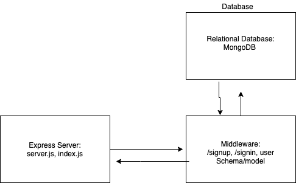

# basic-auth

> in this class i know so many thing like 

+ middleware
+ supertest
+ workflows
+ jest
+ DataBase
+ Relation in DB
+ Auth
    (BASE-64 and HASH Data)

# [Heroku](https://basic-auth00.herokuapp.com/)

***

# [pull request](https://github.com/EmadIdris/basic-auth/pull/2)

# UML

